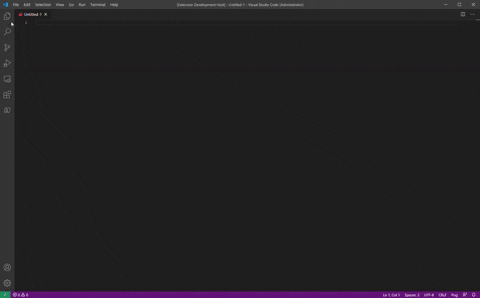
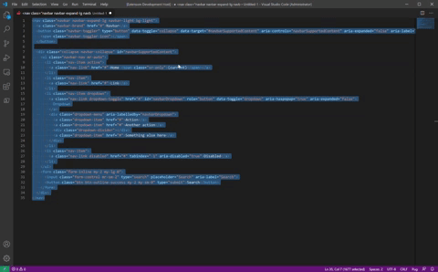

# Visual Studio Code Extension - Convert HTML to Pug

__Convert HTML to Pug__ is a Visual Studio Code extension that allows you to right click selected HTML text and convert it automatically into [Pug](https://pugjs.org/api/getting-started.html). _Pug was formerly known as Jade_.

## Install Options

* [Click to Install from the Visual Studio Market Place](https://marketplace.visualstudio.com/items?itemName=ditto.convert-html-to-puge)

* Search Extensions Menu with `ditto.convert-html-to-pug`

## Features

1. Select Text and right click over selected text and select "Convert HTML to Pug". Then the extension will attempt to convert the html text to pug

2. Select Text Run a command by pressing (Ctrl+P) or (Cmd+P) and run `> Convert HTML to Pug`

## Commentary

* Thanks to [@izolate](https://github.com/izolate) for creating the [html2pug](https://github.com/izolate/html2pug) project. This extension uses it to do the underlying conversion.
* This project is heavily used for our website development at Ditto - https://www.ditto.live